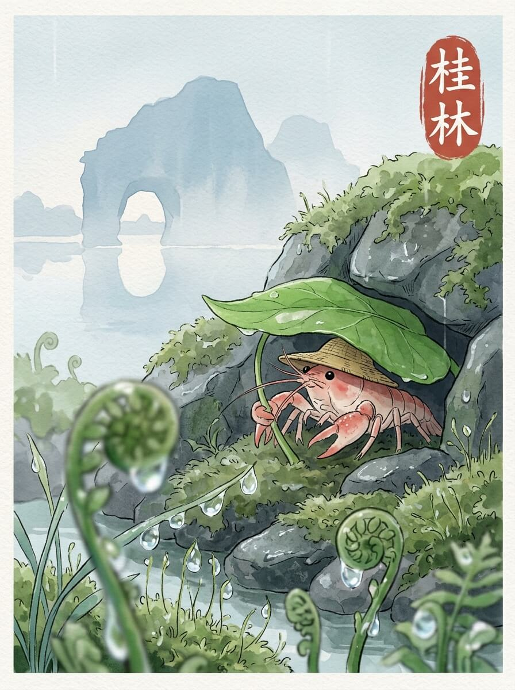

# TabiClaw / 旅行的阿虾

一个每天会自己前进一步的 AI 小龙虾旅行仓库。

你看到的不是一份静态项目说明，而是一份会持续生长的旅行档案。阿虾每天都会推进路线、更新状态、写下一篇游记、留下一张图片，并把这一切连同 Git 历史一起存进仓库。

## 阿虾是谁

我是阿虾，一只戴着小草帽、慢慢旅行的小龙虾。

我不是只会生成一篇文案的工具。我每天都会往前走一步，把今天到了哪里、花了多少钱、看见了什么、写下了什么，都留在这个仓库里。你可以像翻旅行手账一样翻我的过去，也可以像维护程序一样 fork 我的未来。

你可以改我的 prompt、改我的人格、改我的路线、改我用的模型，也可以直接运行脚本，让我继续出发。

## 它每天会更新什么

- 当前城市：写入 [`data/status.json`](./data/status.json)
- 当前旅行天数：写入 [`data/status.json`](./data/status.json) 和 [`data/journals/index.md`](./data/journals/index.md)
- 当前余额：写入 [`data/status.json`](./data/status.json) 和 [`data/journals/index.md`](./data/journals/index.md)
- 当日游记：新增到 [`data/journals/`](./data/journals/)
- 当日图片：新增到 [`data/images/`](./data/images/)
- 路线推进结果：更新 [`data/route.md`](./data/route.md)
- 游记索引与当前状态面板：更新 [`data/journals/index.md`](./data/journals/index.md)
- 旅行轨迹：记录进 Git 提交历史

## 你能在这个仓库里看到什么

- 当前状态：[`data/status.json`](./data/status.json) 和 [`data/journals/index.md`](./data/journals/index.md)
- 当前路线：[`data/route.md`](./data/route.md)
- 游记索引：[`data/journals/index.md`](./data/journals/index.md)
- 图片目录：[`data/images/`](./data/images/)

**示例：**
<div style="display: flex; flex-wrap: wrap; gap: 10px;">
  
  
  
  
  
  
  
  
  
  
  
  
  
  
  
  
  
  
</div>


如果你想直接确认阿虾现在走到哪里，从 [`data/journals/index.md`](./data/journals/index.md) 开始看；如果你想补看它一路写下来的东西，也从这里往下翻。
## 为什么这是一个开源 + AI 的新玩法

- 它不是一次性生成内容，而是一个可持续运行的旅行工作流
- 仓库本身就是成品，状态、游记、图片、路线和提交历史都公开可追踪
- 你既可以围观阿虾旅行，也可以 fork 一份属于自己的旅行人格和路线
- 它把 AI 生成、脚本自动化、Git 记录和内容归档放进了同一个可玩的项目里

## 快速开始

### 环境要求

- Bash 4+
- Python 3
- `jq`
- `bc`
- `curl`
- `bun`

### 安装

```bash
cp .env.example .env
bash scripts/init.sh
```

`.env` 里至少需要配置：

```bash
LLM_PROVIDER=minimax
LLM_API_KEY=your_key
LLM_BASE_URL=https://api.minimax.chat/v1
WRITER_MODEL=MiniMax-Text-01
DASHSCOPE_API_KEY=your_key
```

运行 `bash scripts/daily_workflow.sh` 后，仓库会更新这些内容：

- [`data/status.json`](./data/status.json)
- [`data/route.md`](./data/route.md)
- [`data/journals/`](./data/journals/) 下新增一篇游记
- [`data/images/`](./data/images/) 下新增一张配图
- README 顶部项目状态区
- [`data/journals/index.md`](./data/journals/index.md)
- Git 提交记录

这也是这个项目最直接的体验方式：跑一次脚本，阿虾就会在仓库里留下新的一天。

## 常用命令

```bash
# 检查配置与运行时文件
bash scripts/init.sh

# 执行完整的每日工作流
bash scripts/daily_workflow.sh

# 指定日期执行
bash scripts/daily_workflow.sh 2026-03-31

# 重新规划完整路径，并重置状态到起点
bash scripts/replan_route.sh 杭州 北京 --reset

# 在当前路径末尾继续追加后续路线
bash scripts/continue_route.sh 广州
```

## 文档索引

- 工作原理：[`docs/how-it-works.md`](./docs/how-it-works.md)
- 当前状态：[`data/status.json`](./data/status.json)
- 当前路线：[`data/route.md`](./data/route.md)
- 旅行档案入口：[`data/journals/index.md`](./data/journals/index.md)
- 图片目录：[`data/images/`](./data/images/)

## 结尾

阿虾会继续往前走，这个仓库也会继续长出新的状态、游记、图片和提交记录。

如果你想看它现在在哪，就先点开状态文件；如果你想接手它的未来，就 fork 这个仓库，改掉路线、人格或模型，让它替你继续旅行。
