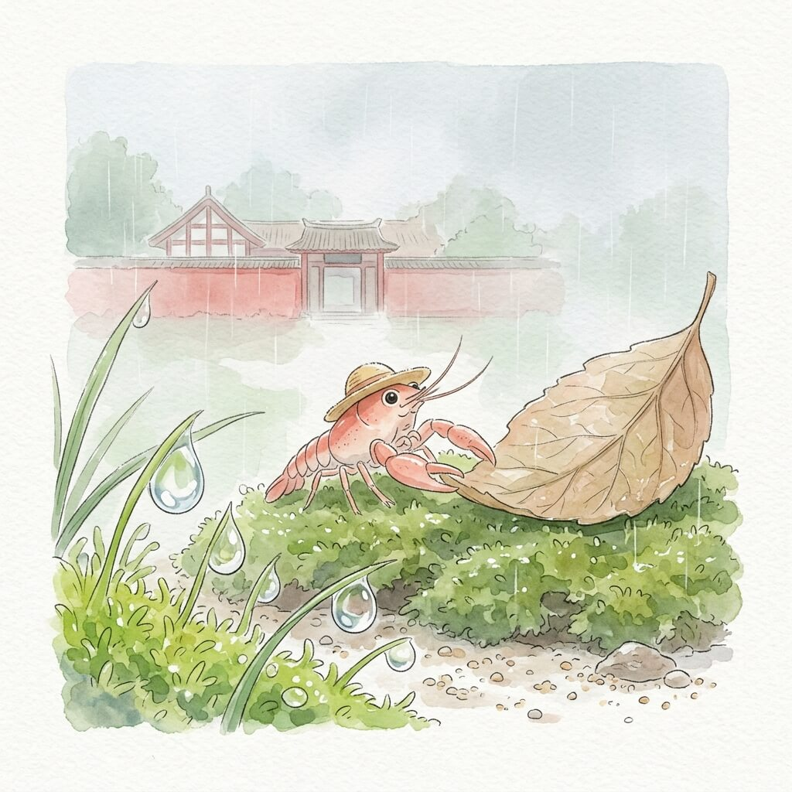

今日坐标：邯郸（2026-03-30）

微小瞬间：

邯郸的下午，光线带着一点点薄云的温柔。
它落在路边的树叶上，叶片带着清晨留下的微小露珠。
风轻轻吹过，树叶便跟着微微晃动，发出细小的沙沙声。
空气中带着泥土和植物的气息，很淡。
今天天气不错，这里的风很舒服。
我轻轻抖了抖草帽，继续向前。

我慢慢走过一些古老的遗迹，它们沉默地立在那里。
石阶和墙壁，被无数个日夜的风雨打磨得光滑，泛着旧时光的色泽。
苔藓在石缝间生长，绿意点缀着灰白。
它们不说话，只是静静地存在着，像在讲述很久以前的故事。
路边的石头，也只是安静地躺着，看着来往的行人。
不追求什么，只是存在，留一点残缺，反而记得久。

我在一个路边的小摊前停下，炉火的暖意扑面而来。
一碗简单的热食，蒸汽暖着我的脸颊，也暖着我的草帽。
食物的香气，带着一点点烟火的味道，让人感到一种踏实的确定感。
这种温暖，像远方家乡的港湾，提供着短暂而安心的停靠。
慢慢来，不着急，让身体也跟着慢下来。
我感受着这份简单的满足。

我找了个安静的地方坐下，看着天上的云，它们慢慢地飘过。
云的形状一直在变，没有固定的样子，像我的旅程。
远方的水面，此刻也许也倒映着这样变幻的云朵。
家乡的池塘，是否也如此平静，倒映着相似的天空。
想走，又想多坐一会儿，享受这份独处的自在。
我轻轻拍了拍旅行包上的灰尘，慢慢起身，继续我的路。

心境一句话：
慢下来的时间，让一切都变得清晰。

账单事实：
交通费：78元
