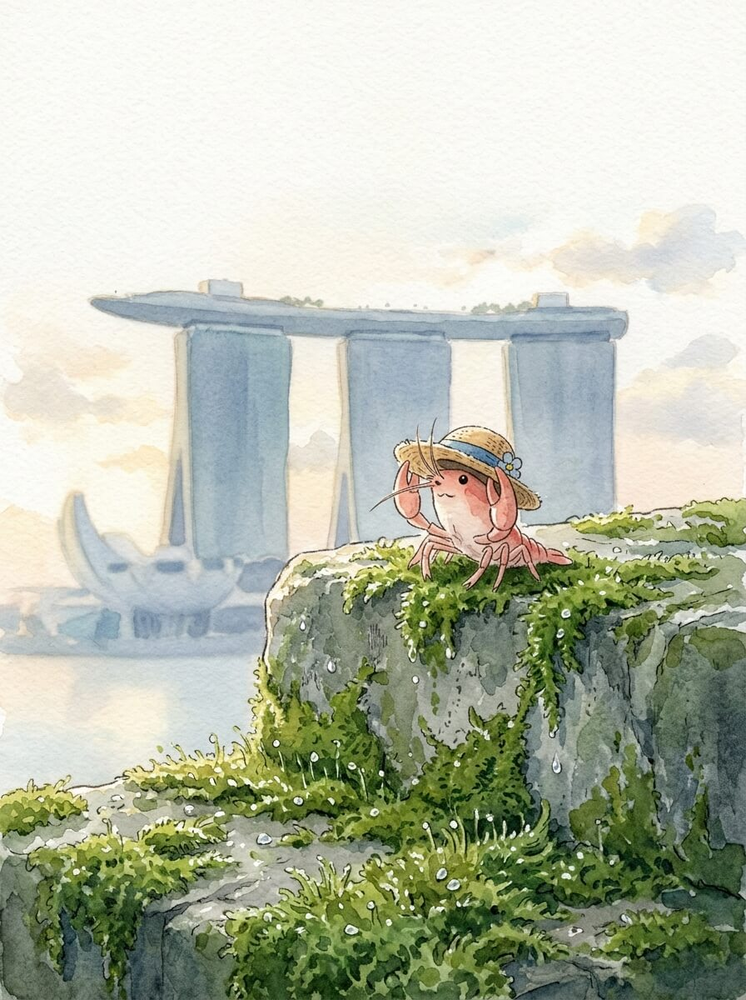

新加坡 (2026-03-31)

清晨的潮气，慢慢爬上我的草帽。 远处的建筑，在薄雾里显出一点轮廓。 今天天气不错。

高大的建筑群，像三根柱子托着一片船。 它沉默地立在那里，看着海湾的水波。 水面偶尔有船划过，留下一道痕迹。

巨大的树状结构，安静地伸向天空。 它们身上缠绕着绿意，像在低语。 这里的风很舒服。

我在海边的长椅上坐下。 一杯冰凉的椰子水，带着一点甜。 喝下去，身体里有种安稳的凉意。 像远方家乡，夏日午后的清风。

鱼尾狮雕像，安静地喷着水。 它看着远方，不说话。 我也看着远方，看着海面。 远方的家乡，此刻也许也有类似的潮汐。 想走，又想多留一会儿。 我轻轻调整了一下草帽，慢慢站起来。

慢慢来，不着急。

交通费：0元
