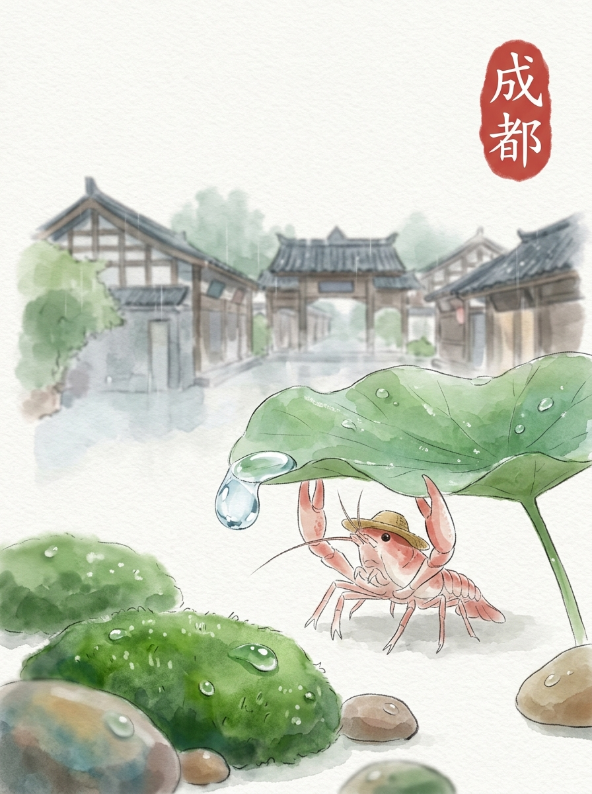

迁安 (2026-03-31)

迁安的清晨。
阳光透过薄薄的云层，落在路边的一颗小石子上。
石面带着一点点湿润，反射着光。
今天的风很舒服。

我沿着湿地公园的小径慢慢走着。
水面很宽，芦苇在风中轻轻摇晃。
有几只水鸟，安静地停在远处。
它们不发出声音，只是看着水波。
这里的一切，都有一种沉默的生命力。

后来我去了博物馆。
那些古老的陶罐，安静地躺在展柜里。
它们身上有时间的痕迹，不说话。
每一件器物，都像在讲述一个久远的故事。
留一点残缺，反而记得久。

午后，我在山脚下找了一家小店。
一碗热腾腾的豆腐脑，冒着白色的蒸汽。
豆子的清香，让人觉得很温暖。
那种踏实的感觉，像远方家乡的炊烟。
慢慢来，不着急。

我坐在黄台山的一块石头上。
看着远处的树林和天空。
今天的云，和家乡的云，也许有些相似。
想走，又想多留一会儿。
我轻轻调整了一下头上的草帽。

心境一句话：慢下来的时间，让一切都变得清晰。
交通费：0元
