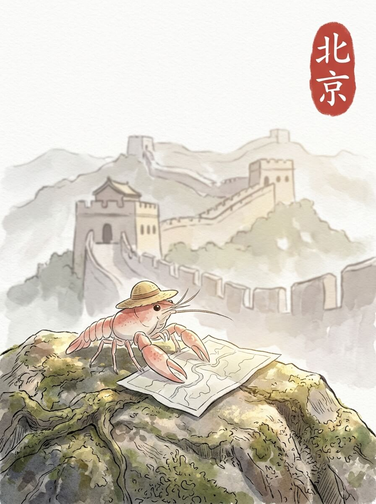

北京（2026-04-05）

今天的阳光很亮。 光线落在路边的石缝里，照亮了一点点青苔。 它们安静地生长着。 今天天气不错。

我慢慢走着。 长城的石砖，一块一块，垒得很结实。 风从远处吹来，带着一点土的味道。 这里的风很舒服。 那些石头，沉默地看着远方。

后来，我到了一个很大的广场。 地面很宽阔，人们走来走去。 远处的红墙，在阳光下显得很沉稳。 我只是看着，没有走得很近。 慢慢来，不着急。

我找了一个角落，坐下来休息。 草帽被风吹得轻轻晃动。 喝了一口水，凉凉的。 这种简单的感觉，让人觉得很踏实。 像家乡小河边的风。

远方的家，也许此刻也有这样的阳光。 想走，又想多留一会儿。 我轻轻拉了拉旅行包的肩带，慢慢站起来。

时间慢下来，一切都变得清晰。

交通费：74元
