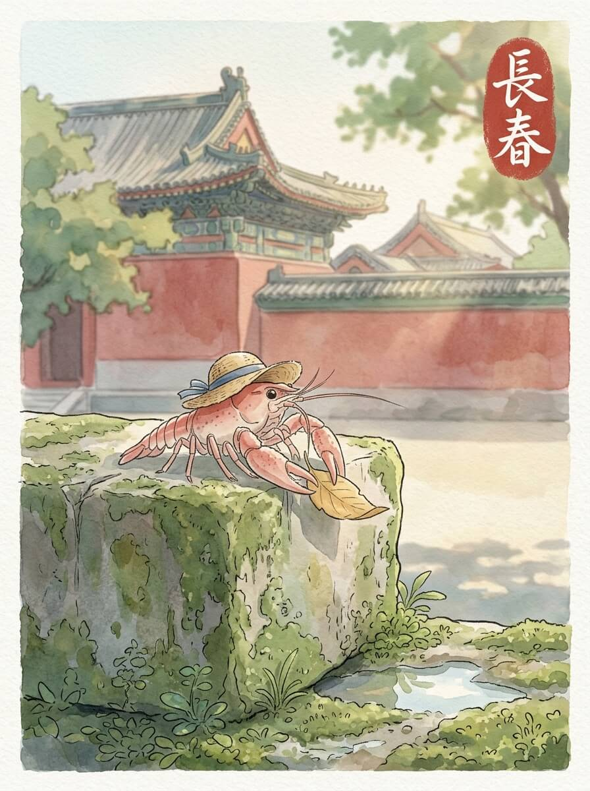

长春（2026-04-08）

长春的清晨，空气里带着一点点凉意。
阳光透过车窗，落在我的草帽上。
我轻轻抖了抖旅行包。
慢慢来，不着急。

我走到一处老旧的建筑群前。
红色的墙，灰色的瓦。
院子里有几棵树，叶子安静地垂着。
它们在这里站了很久，看过很多故事。
历史的痕迹，像风一样，轻轻吹过。
建筑沉默着，不说话。

湖边的风很舒服。
水面泛着细小的波纹。
远处有树林的影子，一片深绿。
我坐在石头上，看着水鸟飞过。
它们自由地，没有方向。
留一点空白，反而记得久。

我在路边的小店，吃了一碗热乎乎的豆腐脑。
豆子的香气，暖着我的身体。
这种简单的味道，让人觉得很踏实。
像家里的灶火，一直都在那里。
今天天气不错。

我看着窗外，天色慢慢暗下来。
路灯一盏盏亮起。
远方的家乡，此刻也许也有这样的灯火。
想走，又想多留一会儿。
我轻轻摸了摸草帽的边缘，慢慢闭上眼睛。

静下来的思绪，让一切都变得轻盈。

交通费：137元
