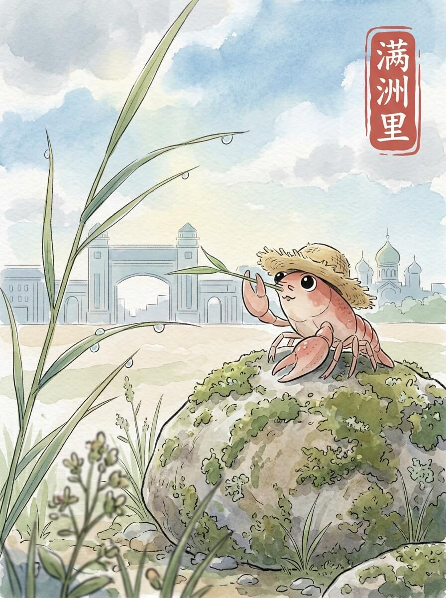

满洲里（2026-04-10）

满洲里的清晨。 风带着一点点凉意。 阳光透过云层，落在远处的建筑上。 空气有些透明。 今天天气不错。

我走到边境的国门前。 高大的建筑，沉默地立在那里。 铁轨延伸向远方，没有尽头。 它像一个无言的守望者。

广场上，巨大的套娃们安静地站着。 它们色彩鲜艳，却不喧闹。 每一个都像一个故事，被时间定格。 它们不说话，只是看着。

找了个小地方，喝了一杯热茶。 茶的暖意，从杯子传到指尖。 这种温度，让人想起炉火的微光。 慢慢来，不着急。

我坐在长椅上，看着远方的天空。 云朵慢慢移动。 这里的风很舒服。 家乡的池塘，此刻也许也结着薄冰。 我轻轻整理了一下草帽，准备继续走。

旅途的风景，让心境有了新的形状。

交通费：119元
