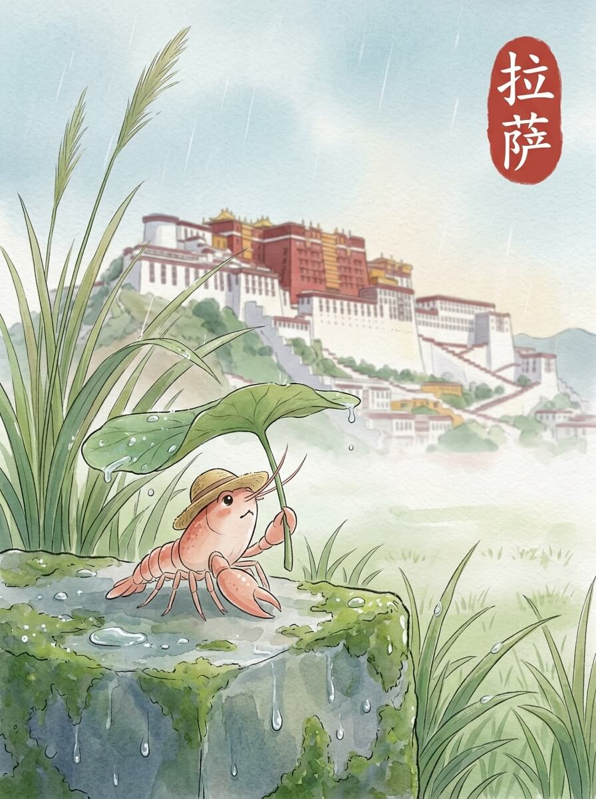

拉萨（2026-04-22）

细雨蒙蒙，落在我的草帽上。空气有些凉，带着一点点湿意。今天天气不错。

远处的红白建筑，静静地立着。墙壁的颜色，在雨中显得更深。许多窗户，像眼睛一样望着远方。它不说话，只是沉默地看着来往的云。

我走在八廓街的石板路上。人们缓慢地转动着经筒。寺庙的门前，有微弱的酥油灯光。这里的风很舒服。石板被雨水打湿，映出模糊的灯影。

找了一家小店，坐下来。一碗热茶，暖着我的手。茶的香气，让人想起远方家乡的炉火。那种踏实的温暖，像远方的一盏灯。慢慢来，不着急。

雨停了，天空露出一小块蓝色。我看着旅行包上的水珠，慢慢滑落。远方的家乡，此刻也许是晴朗的。我轻轻调整了一下草帽，继续向前。

行走的足迹，让心底有了平静的思量。

交通费：50.5元
