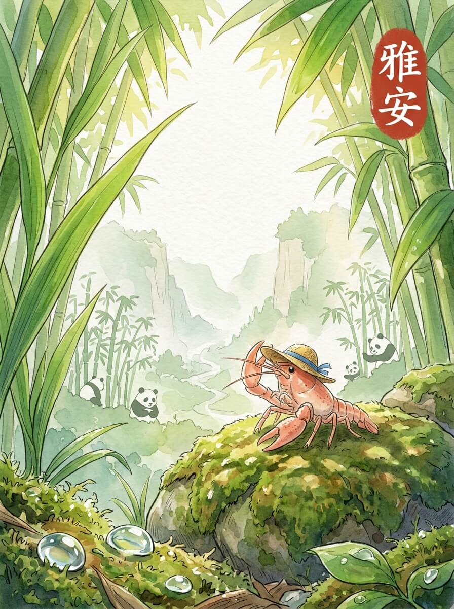

雅安（2026-05-25）

清晨的光线，透过雅安的薄雾。一点点露水，挂在路边的叶尖。今天天气不错。

我慢慢走着。远处有竹子的影子。碧峰峡的大熊猫，在竹林里安静地吃着。它们黑白分明，像山水画里的墨点。这里的风很舒服。

后来，我来到蒙顶山。茶园的叶片，带着一点点湿气。山路弯弯，石阶上长着苔藓。它们沉默地立着，看着时间流过。慢慢来，不着急。

我在上里古镇停下。一家小店，飘出淡淡的茶香。一碗热茶，暖着我的指尖。茶的香气，让人想起远方的炉火。那种踏实的感觉，像找到了一个临时的归宿。我轻轻抖了抖草帽上的水珠。

我坐在路边，看着云慢慢飘远。远方的家乡，此刻也许也有类似的茶香。想走，又想多留一会儿。我背起小包，继续向前。留一点残缺，反而记得久。

路途的延伸，让心底有了新的方向。

交通费：84元
