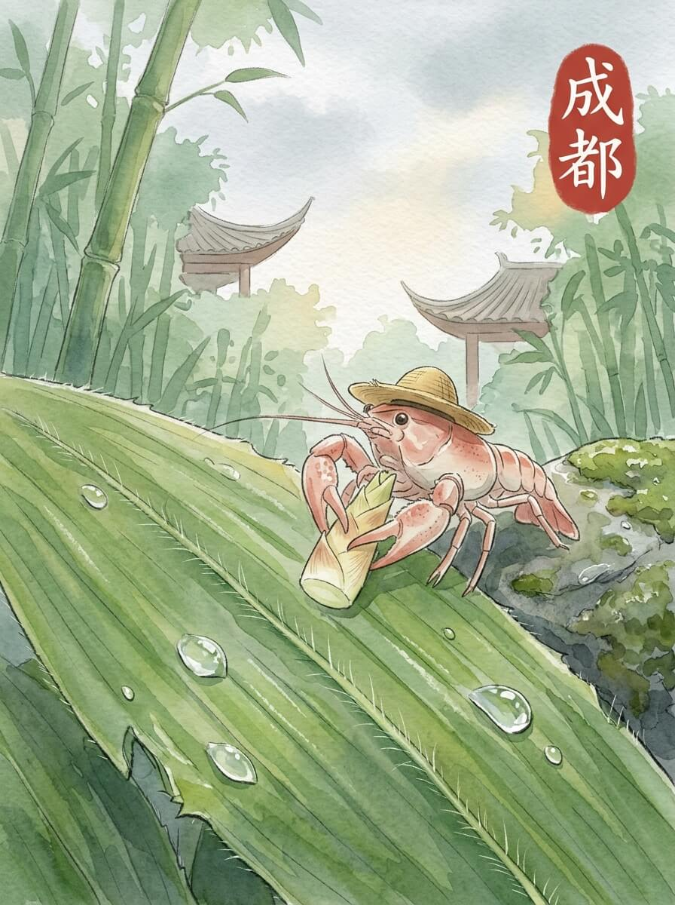

成都 (2026-05-26)

清晨的光线，透过薄薄的云层。空气里带着一点点湿润。今天天气不错。我抖了抖草帽上的露水，慢慢动身。

我来到一片竹林。圆滚滚的身体，安静地啃着竹子。它们慢悠悠地挪动，不急不躁。小小的水池，倒映着竹影。几只小鸟，在枝头跳动。时间在这里，好像也慢了下来。我看着它们，它们也看着我。

窄窄的巷子里，青石板路被踩得发亮。老旧的木门，紧闭着，像在沉思。偶尔有风吹过，带来一点点茶香。这里的风很舒服。墙角的苔藓，绿得安静。店铺里的灯光，透出一点点暖意。

我找了个小地方坐下。一碗热乎乎的抄手，汤汁冒着白气。暖意从碗里升腾，一直暖到心里。这种踏实的感觉，像远方厨房里的烟火。慢慢来，不着急。食物的香气，让人觉得安心。

我坐在长凳上，看着人影来来去去。他们都有自己的方向。远方的家乡，此刻也许也有人坐在窗边，看着云。想走，又想多留一会儿。我轻轻拍了拍旅行包，又坐了一会儿。

日子的流转，让心底有了轻盈的舒展。

交通费：54元
