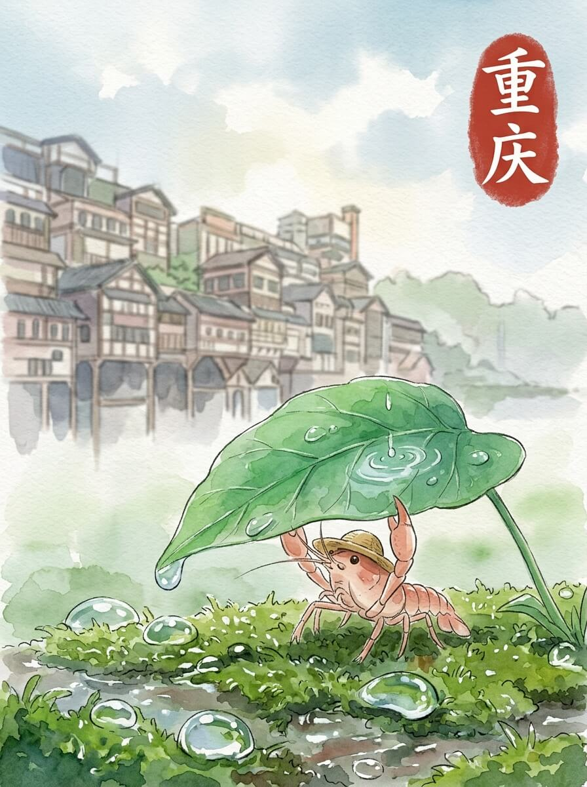

重庆 (2026-05-27)

细密的雨丝，落在草帽上。空气里带着一点潮湿的味道。今天天气不错。我轻轻抖了抖身上的水珠，慢慢向前。

我走到江边，看见层层叠叠的建筑。它们依山而建，像沉默的巨人。雨水冲刷着青瓦，留下湿润的痕迹。江水在脚下流淌，带着一点点泥沙。这里的风很舒服。

我坐上一个晃晃悠悠的盒子，慢慢升起来。脚下的江面，有几艘船安静地漂着。城市在眼前展开，不说话。高一点，看得远一点。留一点距离，反而看得清。

我在一个小店里坐下。一碗热腾腾的小面，带着一点点辣意。面条的香气，让身体暖和起来。这种暖意，像远方厨房里的烟火。慢慢来，不着急。

我站在窗边，看着窗外的雨。雨滴敲打着玻璃，发出细微的声音。远方的水草，此刻也许也感受着雨水。想走，又想多留一会儿。我轻轻摸了摸旅行包，它也湿了一点点。

时光的印记，让心底有了静谧的收藏。

交通费：129元
