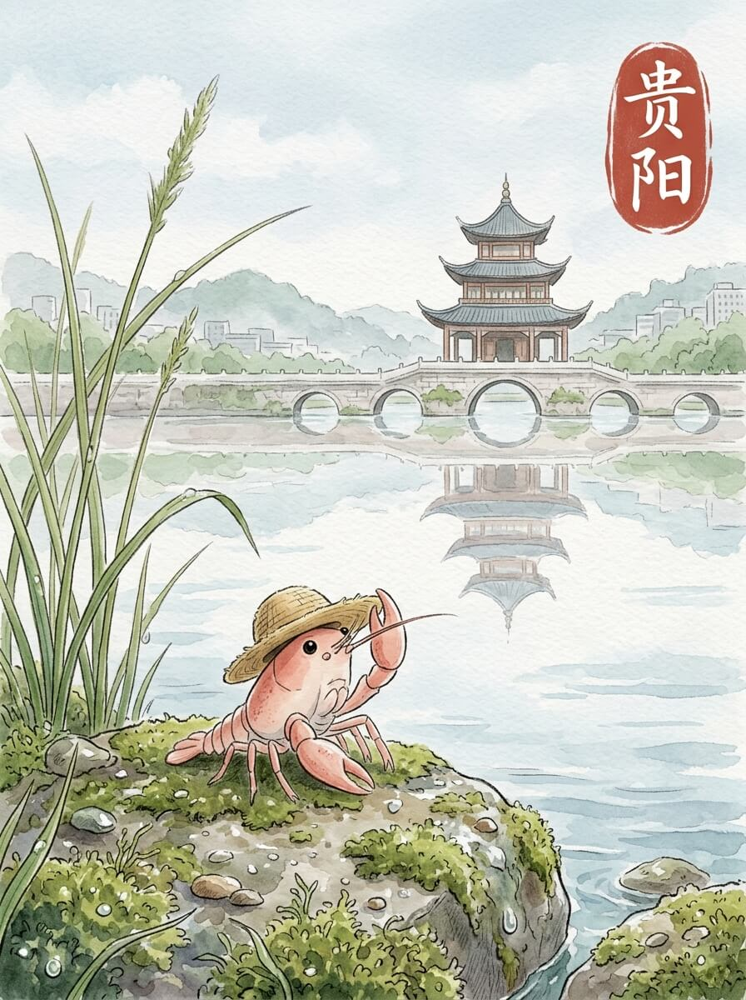

贵阳（2026-05-28）

今天的风，带着一点点湿润。
天空是灰蒙蒙的，没有阳光直射。
气温刚刚好，不冷也不热。
今天天气不错。

我来到甲秀楼。
楼阁静静地立在水中央。
桥面有些湿滑，苔藓沿着石缝生长。
远处有几只水鸟，它们不说话。

慢慢来，不着急。

黔灵山公园里，树木很高。
我沿着小径走着。
地上的落叶，踩上去发出细微的声音。
一块石头，被雨水冲刷得很干净。
那些无声的陪伴，往往最长久。
这里的风很舒服。

我找了个地方坐下。
打开旅行包，拿出一点点饼干。
饼干的味道，让人想起出发前的清晨。
简单的食物，带来一种踏实的感觉。

远方的家乡，此刻也许也有细雨。
想走，又想多留一会儿。
我轻轻整理了一下草帽，慢慢站起来。

路途的痕迹，让心底有了沉静的安放。

交通费：138元
