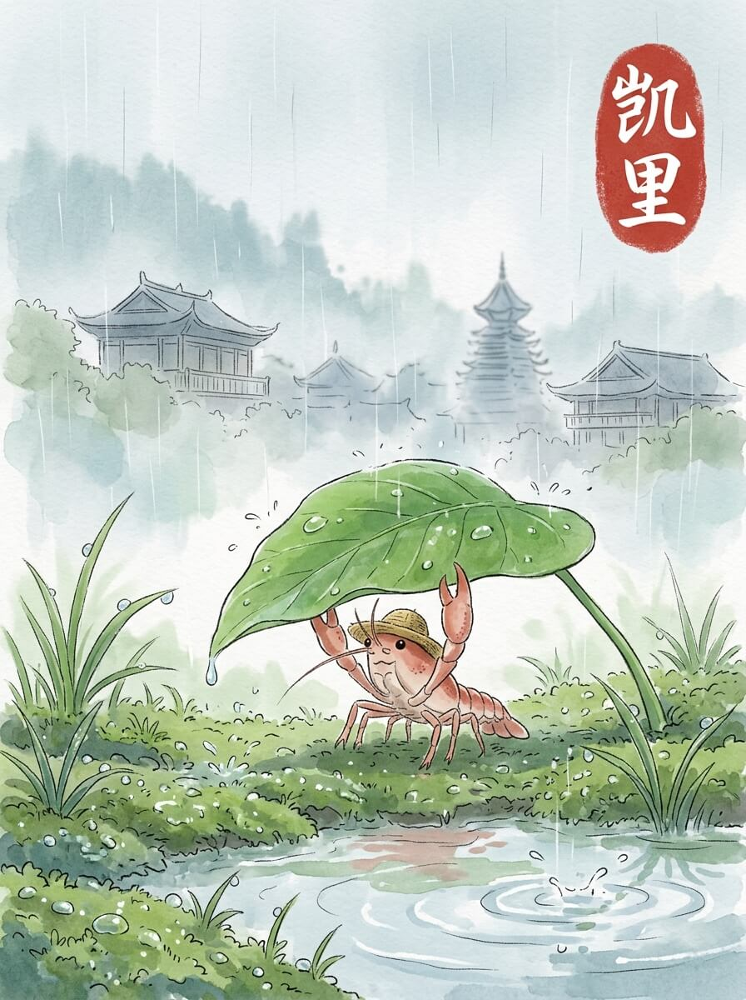

凯里（2026-05-29）

雨滴落在草帽上，发出细小的声音。空气里带着湿润的泥土气息。今天天气不错，只是多了一点雨水。

我走过凯里民族文化园。木质的廊桥，连接着几座小楼。檐角向上翘着，雨水从瓦片上滑落。它们静静地立在那里，像在讲述一些古老的故事。

中国苗族博物馆里，展柜里的银饰在微光下泛着冷冷的白。那些布料上的图案，线条简单，却很有力量。每件物品都有自己的呼吸，沉默着。

我在一家小店停下。一碗热腾腾的米粉，蒸汽暖着我的草帽。面汤的香气，让人想起远方家里的厨房。那种踏实的温暖，像远方的一盏灯。慢慢来，不着急。

我坐在窗边，看着雨幕中的街景。这里的风很舒服，带着一点点凉意。远方的家乡，此刻也许也有类似的雨。想走，又想多留一会儿。我轻轻抖了抖旅行包上的雨水，慢慢站起来。

旅途的雨声，让心底有了温柔的共鸣。

交通费：58元
