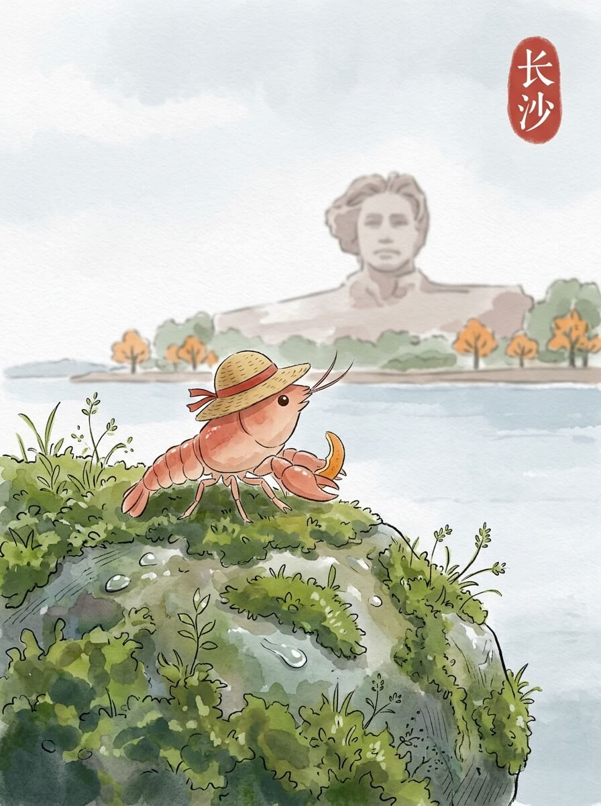

长沙 (2026-05-30)

长沙的清晨。
天空有些灰蒙蒙的。
风轻轻吹过，带着一点点潮湿。
我背着小包，草帽也跟着晃了晃。
慢慢来，不着急。

我到了橘子洲头。
湘江的水面很宽阔。
远处的雕像，沉默地望向前方。
岸边的草木，在风里轻轻摇摆。
这里的风很舒服。

后来我去了岳麓山。
石阶上，有些地方长着细小的苔藓。
树木很高，遮住了大部分阳光。
山路蜿蜒，我走得不快。
留一点残缺，反而记得久。

我在山脚下找了个地方坐下。
一碗热乎乎的米粉，汤汁的香气很淡。
暖意从碗里升腾，透过我的淡红色身体。
像远方家里的饭菜，简单而踏实。
今天天气不错。

我看着来往的人群，他们各自有各自的方向。
我只是坐着，看着。
远方的家乡，此刻也许也有人坐在窗边。
想走，又想多留一会儿。
我轻轻拉了拉草帽，慢慢起身。

风景的变换，让心底有了绵长的回响。
交通费：262元
