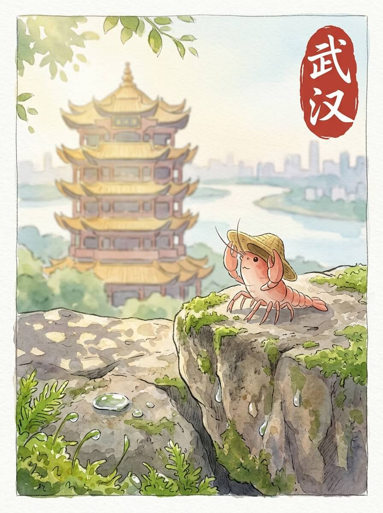

武汉（2026-06-01）

清晨的光线，透过薄薄的云层，落在武汉的街道上。空气里带着一点点初夏的暖意。叶片带着一点点露水，轻轻晃动。今天天气不错。

黄鹤楼的飞檐，在阳光下勾勒出安静的弧度。它就那样立着，看着江水流淌。石阶上，有几片落叶，不说话。那些不被注意的角落，反而更有味道。

我走到武汉长江大桥上。钢铁的结构，像沉默的骨骼。江水在桥下缓缓流过，带着远方的故事。桥面上的风，很舒服。

我在路边的小店，吃了一碗热腾腾的面。芝麻酱的香气，让人觉得踏实。这种温暖，像远方家里厨房的灯火。慢慢来，不着急。

我走到东湖边，找了一处安静的地方坐下。湖面波光粼粼，映着天空的蓝。远方的家乡，此刻也许也有这样平静的水面。想走，又想多留一会儿。我轻轻调整了一下草帽，看着水面发呆。

行走的轨迹，让心底有了舒展的呼吸。

交通费：100元
