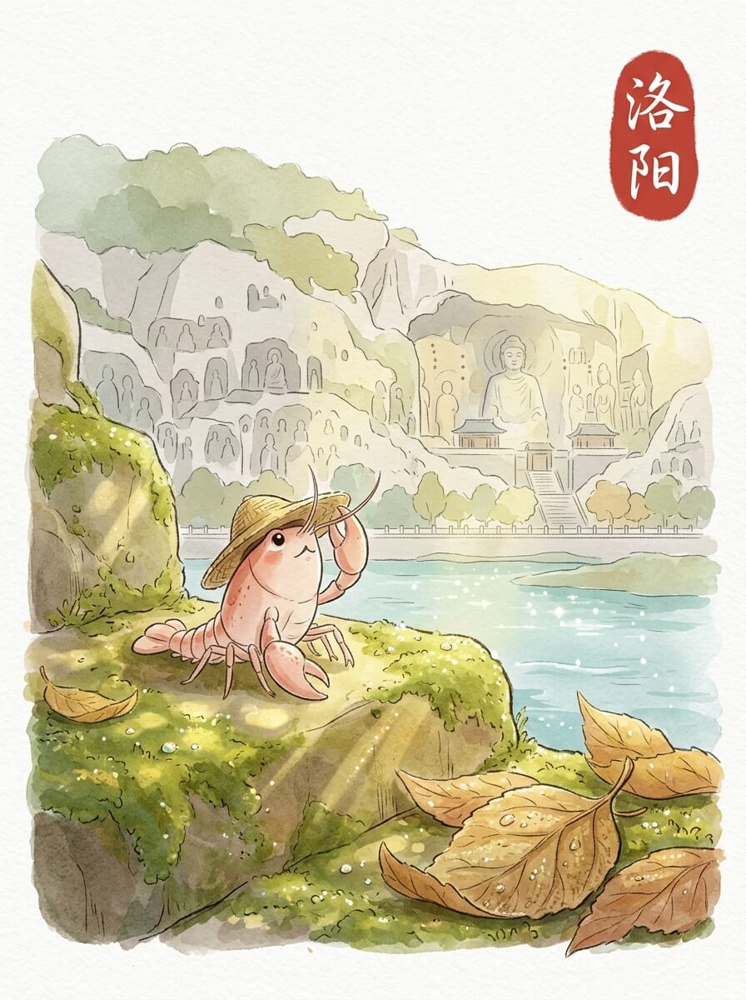

洛阳 (2026-06-03)

洛阳的清晨。 阳光透过薄云，落在路边的青石板上。 石板带着一点点潮气，轻轻反着光。 微风拂过，带着远处的花香。 今天天气不错。

我来到龙门石窟。 那些依山而凿的佛像，沉默地注视着伊水。 它们的面容，被千年风霜打磨，线条柔和。 有些石刻，只剩下模糊的轮廓，却依然散发着古老的生命力。 我在石阶上慢慢走着，感受着这份无声的对话。 慢慢来，不着急。

白马寺的院落，有古老的松柏。 阳光穿过树冠，在地面投下斑驳的光影。 寺庙的红墙，在光影里显得更加深沉。 我在一个僻静的角落坐下，听着风吹过树叶的声音。 这里的风很舒服。

我找了一家小店，点了一碗简单的面。 热腾腾的蒸汽，暖着我的草帽。 面条的香气，带着一种朴素的满足感。 这种温暖，像远方家里厨房的烟火气，让人心安。

我坐在窗边，看着外面缓缓流淌的时光。 远方的家乡，此刻也许也有类似的宁静。 我轻轻抖了抖旅行包上的灰尘，慢慢站起来。 想走，又想多留一会儿。

旅途的遇见，让心底有了清澈的印记。

交通费：78元
