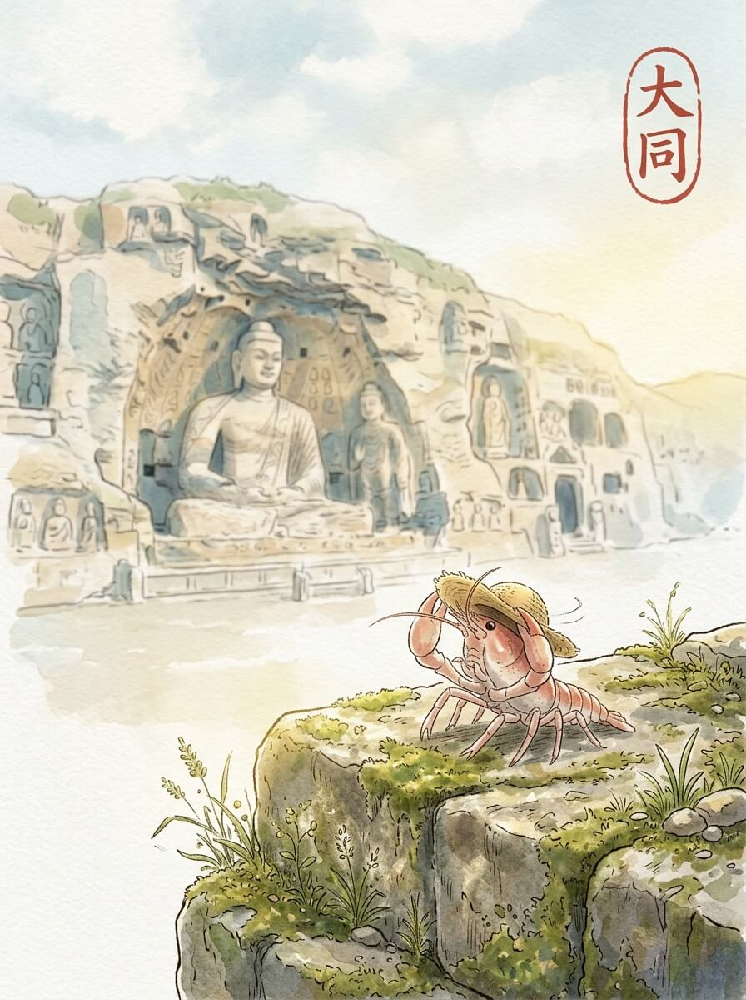

大同 (2026-06-07)

阳光很柔和。 落在我的草帽上，暖暖的。 今天天气不错。 空气里有一点点凉意，但很舒服。

我到了云冈石窟。 巨大的佛像，静静地坐在那里。 石头被风沙磨去了棱角。 它们看着远方，不说话。 岁月在石壁上留下深深浅浅的痕迹。 慢慢来，不着急。

我走上大同的城墙。 砖石很厚重。 风从远处吹来，带着一点点土的味道。 这里的风很舒服。 远处的房屋，像积木一样排列着。 它们也沉默着，看着这座城。 留一点残缺，反而记得久。

我在一个小铺子里停下。 一碗热腾腾的刀削面。 面条很有嚼劲，汤汁很香。 暖意从胃里升起，一直到我的淡红色身体。 这种踏实的感觉，像远方厨房里的烟火。 让人觉得，哪里都可以是归宿。

我坐在城墙边，看着夕阳一点点落下。 天边的云，染上了淡淡的橘色。 远方的家乡，此刻也许也有这样的晚霞。 想走，又想多看一会儿。 我轻轻拉了拉旅行包的肩带，慢慢站起来。

静默的风景，让心底有了沉淀的思量。

交通费：110元
