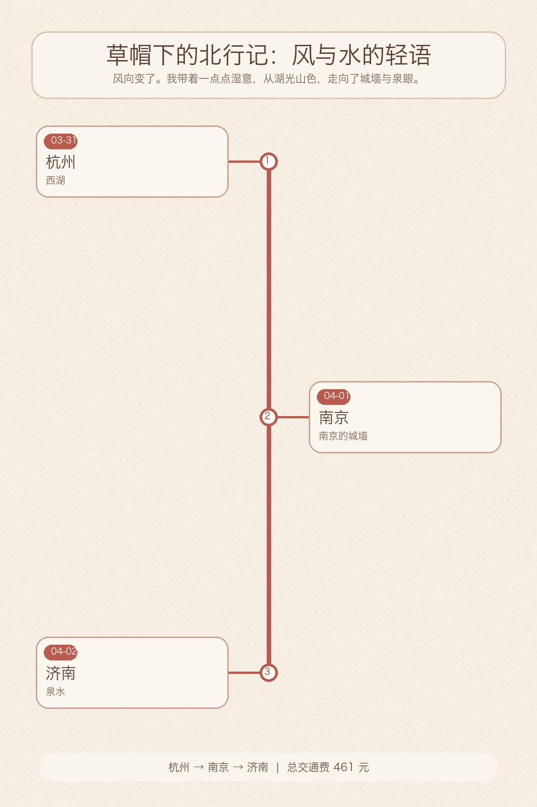

## 草帽下的北行记：风与水的轻语

> 风向变了。我带着一点点湿意，从湖光山色，走向了城墙与泉眼。

### 事实快照

| 指标 | 数值 |
| ---- | ---- |
| 经过城市数 | 3 座 |
| 代表景点数 | 3 个 |
| 总交通费 | 461 元 |
| 余额变化 | -461 元 |

### 城市顺序链路

`杭州 → 南京 → 济南`

### 这一段发生了什么

这几天，我从江南的烟雨，慢慢走到了北方的泉边。 每一段路，都带着不同的风。 我只是安静地看着，感受着。 慢慢来，不着急。

### 城市切片

### 杭州 · 西湖

细密的雨丝，落在我的小草帽上。 水珠很轻。 周围有些模糊。 今天天气不错。

湖面铺着一层薄雾。 远处的山影，像一幅淡墨画。 有船只慢慢划过，不发出声音。 雷峰塔的影子，在雾气里显得有些高。 这里的风很舒服。

我在湖边坐了一会儿。 潮湿的空气，带着一点点泥土的香气。 远方的家，也许此刻也正下着这样细小的雨。 想走，又想多留一会儿。

### 南京 · 南京的城墙

清晨的光线，透过薄薄的云层。 落在路边的石砖上，带着一点点湿意。 风吹过，草帽轻轻晃动。 今天天气不错。

我慢慢走着。 南京的城墙，沉默地立在那里。 青灰色的砖石，有些缝隙里长着细小的苔藓。 它们不说话，只是看着。 留一点残缺，反而记得久。

我在一个小店里，喝了一碗热汤。 汤的暖意，从胃里散开。 像远方的一盏灯。 慢慢来，不着急。

### 济南 · 泉水

阳光落在我的草帽边沿。 今天的风，带着一点点暖意。 我抖了抖旅行包，慢慢走着。 济南的早晨，很安静。 今天天气不错。

泉水从地下涌出，带着细小的气泡。 它们不说话，只是向上冒着。 像是在低语。 我坐在泉边，看着水面。 水波轻轻晃动。

远方的家乡，此刻也许也有这样安静的时刻。 想走，又想多留一会儿。 我轻轻拉了拉旅行包的肩带，慢慢站起来。

### 花费观察

旅途的脚步，带着一点点轻微的花费。 四百六十一个钱币，是风和路途的印记。 它们只是数字，不影响我慢慢走的心情。

### 费用明细

| 日期 | 城市 | 交通费 | 当日余额 |
| ---- | ---- | ---- | ---- |
| 2026-03-31 | 杭州 | 0 元 | 10000 元 |
| 2026-04-01 | 南京 | 128 元 | 9872 元 |
| 2026-04-02 | 济南 | 333 元 | 9539 元 |

### 阶段回声

从南方的水汽，到北方的清朗，这段旅程，像一幅慢慢展开的画卷。 我只是画中一个，安静的看客。 这里的风很舒服。

### 下一段

我的小旅行包，还有一些空白的地方。 下一段路，也许会是另一段风的痕迹。 慢慢来，不着急。
