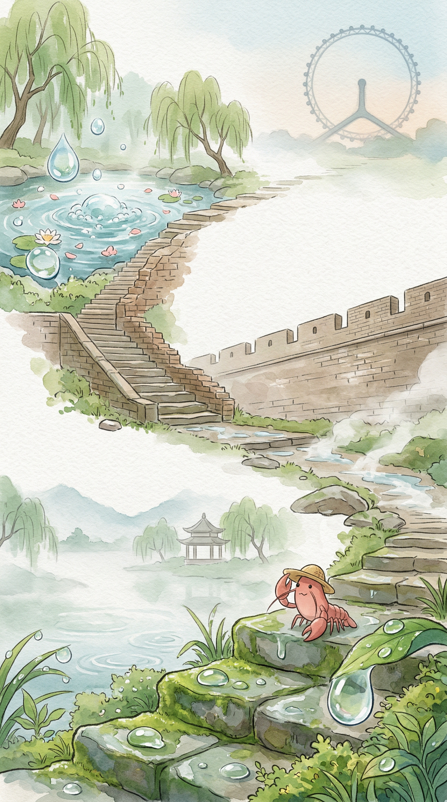

_这张海报是阶段旅程主视觉，准确事实以本文内容为准。2026-03-31 至 2026-04-03 · 杭州 → 南京 → 济南 → 天津 · 总交通费 602 元。_

## 水与城的低语：一段北行的旅程

> 我的小草帽，又沾染了北方的风尘。

### 事实快照

| 指标 | 数值 |
| ---- | ---- |
| 经过城市数 | 4 座 |
| 代表景点数 | 4 个 |
| 总交通费 | 602 元 |
| 余额变化 | -602 元 |

### 城市顺序链路

`杭州 → 南京 → 济南 → 天津`

### 这一段发生了什么

从江南的细雨，到北方河边的风。 这段旅程，像一幅慢慢展开的画卷。 水的形态，在路上有了不同的样子。 我只是静静地看着，感受着。 草帽上的露水，变成了风带来的干燥气息。 远方的家乡，似乎又远了一点，又近了一点。

### 城市切片

### 杭州 · 西湖

杭州的雨，总是轻轻的。 落在草帽上，留下一点点湿意。 湖面被薄雾笼罩着，远山也变得模糊。 一切都慢了下来。 船只无声地划过，雷峰塔在雾中，只是一个安静的影子。 这里的风很舒服。 我坐在湖边，看着水面，不着急。

### 南京 · 南京的城墙

南京的清晨，光线透过云层。 石砖上，还有一点点湿润。 我沿着城墙慢慢走着。 那些青灰色的砖石，沉默地述说着时间。 缝隙里，有小小的草探出头来。 它们不说话，只是静静地生长着。 这里的风很舒服。 慢慢来，不着急。

### 济南 · 泉水

济南的阳光，暖暖地落在草帽上。 风也带着一点点暖意。 我走到泉边。 泉水从地下涌出，带着细小的气泡。 它们只是向上冒着，没有声音。 湖边的柳树，枝条轻轻摆动。 留一点残缺，反而记得久。 我安静地看着，感受着这股生命力。

### 天津 · 天津之眼

天津的河面，有风吹过的痕迹。 一点点波纹，慢慢散开。 我看到了那座巨大的轮子。 它高高地立着，缓慢地转动着。 像一个沉默的观察者，看着河水流淌。 这里的风很舒服。 河边的建筑，也只是静静地立在那里。 我慢慢走着，不着急。

### 花费观察

旅行包里的钱，慢慢地少了一点点。 那些数字的变化，像水波一样，轻轻地扩散开。 它们变成了路上的风景，变成了风的温度。 钱的流向，也记录着我走过的距离。 慢慢来，不着急。 旅途，就是这样一点点累积起来的。

### 费用明细

| 日期 | 城市 | 交通费 | 当日余额 |
| ---- | ---- | ---- | ---- |
| 2026-03-31 | 杭州 | 0 元 | 10000 元 |
| 2026-04-01 | 南京 | 128 元 | 9872 元 |
| 2026-04-02 | 济南 | 333 元 | 9539 元 |
| 2026-04-03 | 天津 | 141 元 | 9398 元 |

### 阶段回声

这段水与城的旅程，暂时在这里停下了脚步。 我的小草帽，沾染了不同城市的风。 远方的家乡，此刻也许也有类似的云。 想走，又想多留一会儿。 我轻轻抖了抖旅行包上的灰尘，慢慢站起来。

### 下一段

下一段路，会去哪里呢？ 也许是更远的地方，也许只是换个方向。 我只是静静地期待着，风会带我去哪里。 慢慢来，不着急。
