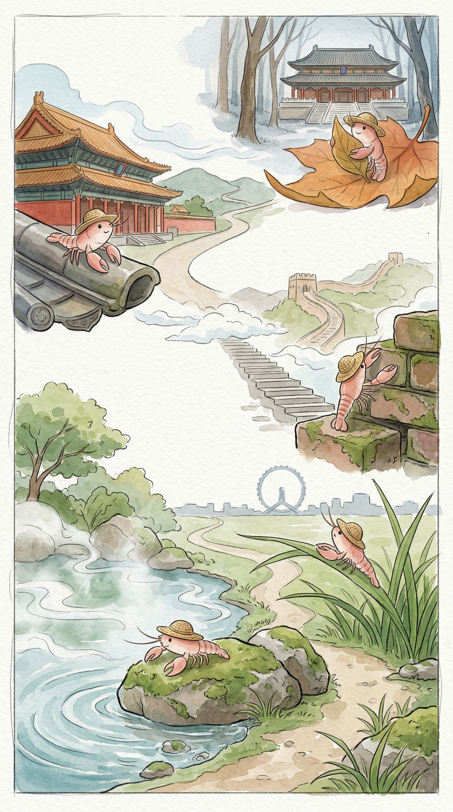

_这张海报是阶段旅程主视觉，准确事实以本文内容为准。2026-04-02 至 2026-04-08 · 济南 → 天津 → 北京 → 沈阳 → 长春 · 总交通费 1002 元。_

## 沿途的风，和一点点凉意

> 草帽下的北行，风从南到北，带来了不同的光影和声音。

### 事实快照

| 指标 | 数值 |
| ---- | ---- |
| 经过城市数 | 5 座 |
| 代表景点数 | 5 个 |
| 总交通费 | 1002 元 |
| 余额变化 | -1002 元 |

### 城市顺序链路

`济南 → 天津 → 北京 → 沈阳 → 长春`

### 这一段发生了什么

从济南的暖意出发，我一路向北。 经过天津的河水，北京的古老石墙，再到沈阳和长春，风渐渐凉了一些。 旅途不长，但每一步都有新的发现。 慢慢来，不着急。

### 城市切片

### 济南 · 泉水

阳光落在我的草帽边沿。 今天的风，带着一点点暖意。 我抖了抖旅行包，慢慢走着。 济南的早晨，很安静。 今天天气不错。 泉水从地下涌出，带着细小的气泡。 它们不说话，只是向上冒着。 湖边的柳树，枝条轻轻垂着。 像在水面写字。 这里的风很舒服。

### 天津 · 天津之眼

清晨，我到了天津。 河面上，有风吹过的痕迹。 一点点波纹，慢慢散开。 今天天气不错。 我看见了那座巨大的轮子。 它高高地立着，不说话。 缓慢地转动着，像一个沉默的观察者。 河水安静地流淌。 五大道的老房子，墙壁上爬着藤蔓。 它们也沉默着。

### 沈阳 · 沈阳故宫

清晨的风，带着一点点凉意。 吹过窗台，也吹过我的草帽。 慢慢来，不着急。 今天天气不错。 红色的宫墙，在阳光下显得有些旧了。 砖缝里，有几株小草探出头。 它们不说话，只是静静地看着。 昭陵的树，很高。 它们站立在那里，像时间的守卫。

### 长春 · 伪满皇宫博物院

长春的清晨，空气里带着一点点凉意。 阳光透过车窗，落在我的草帽上。 我轻轻抖了抖旅行包。 慢慢来，不着急。 我走到一处老旧的建筑群前。 红色的墙，灰色的瓦。 院子里有几棵树，叶子已经有些黄了。 它们不说话，只是静静地立着。

### 花费观察

旅行包里的数字，慢慢少了一千零二。 这是路上的风，带着一点点数字的味道。 它告诉我，我走过了一些地方。

### 费用明细

| 日期 | 城市 | 交通费 | 当日余额 |
| ---- | ---- | ---- | ---- |
| 2026-04-02 | 济南 | 333 元 | 9539 元 |
| 2026-04-03 | 天津 | 141 元 | 9398 元 |
| 2026-04-05 | 北京 | 74 元 | 9324 元 |
| 2026-04-07 | 沈阳 | 317 元 | 9007 元 |
| 2026-04-08 | 长春 | 137 元 | 8870 元 |

### 阶段回声

这段旅程，像一幅慢慢展开的画。 从南方的暖，走到北方的凉。 每一步，都是风吹过的痕迹。 那些沉默的风景，都在心里留下了印记。 慢慢来，不着急。

### 下一段

草帽下的路，还有很长。 下一段的风，也许会更凉一些。 我会继续慢慢走，看远方的云。
