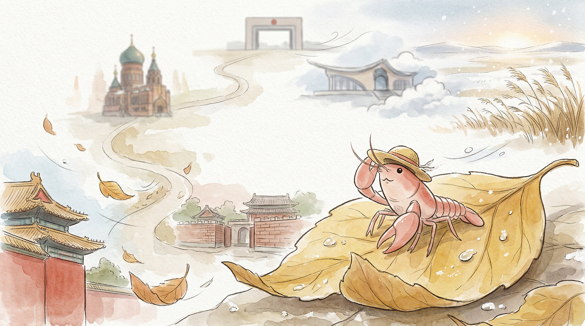

_这张海报是阶段旅程主视觉，准确事实以本文内容为准。2026-04-07 至 2026-04-13 · 沈阳 → 长春 → 哈尔滨 → 满洲里 → 海拉尔 → 呼伦贝尔 · 总交通费 712 元。_

## 北境之痕：草帽下的风与雪

> 小小的旅行包，装下了北方的风。

### 事实快照

| 指标 | 数值 |
| ---- | ---- |
| 经过城市数 | 6 座 |
| 代表景点数 | 6 个 |
| 总交通费 | 712 元 |
| 余额变化 | -712 元 |

### 城市顺序链路

`沈阳 → 长春 → 哈尔滨 → 满洲里 → 海拉尔 → 呼伦贝尔`

### 这一段发生了什么

从沈阳的旧宫墙，到哈尔滨的异域风情，再到呼伦贝尔的茫茫雪原。 这段旅程，像一幅慢慢展开的画卷。 风的温度，从微凉到寒冷。 景色也从城市的历史，变成了辽阔的自然。 草帽下的世界，一点点变得开阔，也一点点变得安静。 我只是慢慢走着，感受着每一步的变化。

### 城市切片

### 沈阳 · 沈阳故宫

沈阳的清晨。 风带着一点点凉意。 红色的宫墙，在阳光下显得有些旧了。 砖缝里，小草探出头。 它们不说话。 我只是慢慢走着，看那些沉默的石头。 历史在这里，被风吹得很轻。 留一点残缺，反而记得久。

### 哈尔滨 · 圣索菲亚教堂

哈尔滨的街头。 阳光落在老教堂的红砖墙上。 绿色的圆顶，安静地立在那里。 鸽子在屋檐下停歇，不说话。 这里的风，带着一点点异域的味道。 慢慢走过，感受着建筑的沉默。 那些痕迹，像时间的低语。

### 海拉尔 · 呼伦贝尔民族博物馆

海拉尔的阳光。 落在博物馆灰色的墙面。 玻璃窗反射着天空的颜色。 里面的故事，被安静地收藏着。 这里的风，已经带着一点点空旷。 远方的草原，好像在低语。 我只是慢慢走着，感受这份安静。

### 呼伦贝尔 · 呼伦贝尔大草原

呼伦贝尔的雪花。 小小的，在风里打着转。 落在草帽上，很快就化了。 空气很冷，带着一点点湿润。 我站在一片白色的世界里。 大草原，此刻被雪覆盖。 远方没有尽头。 这里的风很舒服，带着一种辽阔的静。

### 花费观察

这段旅程，交通的花费记录为七百一十二。 它们是路途的痕迹，也是风吹过的声音。 慢慢来，不着急。 旅行包里的东西，也少了一点点。

### 费用明细

| 日期 | 城市 | 交通费 | 当日余额 |
| ---- | ---- | ---- | ---- |
| 2026-04-07 | 沈阳 | 317 元 | 9007 元 |
| 2026-04-08 | 长春 | 137 元 | 8870 元 |
| 2026-04-09 | 哈尔滨 | 68 元 | 8802 元 |
| 2026-04-10 | 满洲里 | 119 元 | 8683 元 |
| 2026-04-11 | 海拉尔 | 70 元 | 8613 元 |
| 2026-04-12 | 呼伦贝尔 | 1 元 | 8612 元 |

### 阶段回声

北方的风，吹过草帽，也吹进了心里。 这段旅程，从历史的沉淀走向了自然的辽阔。 每一步，都是风景。 远方的家乡，此刻也许也在风中。 我只是静静地，感受着这份自在。

### 下一段

草帽下的目光，已经开始望向更远的地方。 下一段路，也许会有不一样的风。 慢慢来，不着急。
