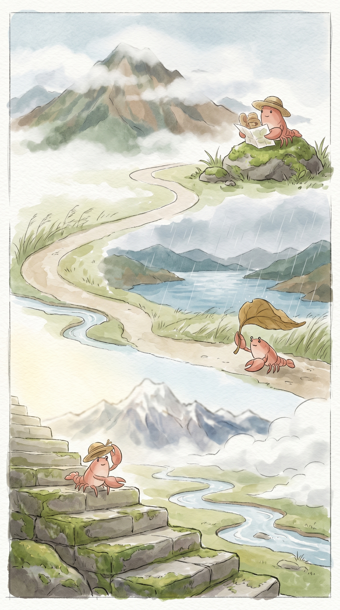

_这张海报是阶段旅程主视觉，准确事实以本文内容为准。2026-05-18 至 2026-05-24 · 稻城 → 亚丁 → 康定 · 总交通费 0 元。_

## 高原的风，草帽下的沉默旅程

> 从日光倾泻到细雨绵绵，风声是唯一的向导。

### 事实快照

| 指标 | 数值 |
| ---- | ---- |
| 经过城市数 | 3 座 |
| 代表景点数 | 3 个 |
| 总交通费 | 0 元 |
| 余额变化 | +0 元 |

### 城市顺序链路

`稻城 → 亚丁 → 康定`

### 这一段发生了什么

这一段路，我走过高原的日光，也感受了山间的风雨。从稻城仙乃日的开阔，到亚丁珍珠海的静谧，再到康定跑马山旁的雨意，风景像缓慢翻动的画卷。天空的颜色，从清澈的蓝，渐渐染上了云的厚重。我只是慢慢走着，看风吹过草地，听雨滴落在叶片。远方的山峦，一直沉默着，陪伴着我的每一步。慢慢来，不着急。

### 城市切片

### 稻城 · 仙乃日

稻城的清晨，阳光透过稀薄的云层。光线落在草叶上，带着一点点露水的光。今天的风很轻。空气里，有泥土和草的清香。我慢慢走到仙乃日附近，山峰沉默地立着。它的影子，投在远处的草甸。我坐在石头上，看着云慢慢飘过。这里的风很舒服。吃了一点简单的干粮，暖意从胃里升起。像远方家里的炉火，安静而踏实。远方的家乡，此刻也许也有相似的光。想走，又想多留一会儿。

### 亚丁 · 珍珠海

到了亚丁，天气变得有些不同。云层厚了一些，风也带着一点湿意。我在珍珠海附近停下。湖水是安静的，偶尔有风吹过，泛起一点点涟漪。旁边的石头，被岁月磨得光滑。它们不说话，只是静静地看着湖水。我找了个地方坐下，喝了一点温水。手中的杯子，传递着暖意。这感觉，像雨后泥土的芬芳，沉静而自然。远方的家，此刻也许正下着雨。慢慢来，不着急。

### 康定 · 跑马山

到了康定，天空飘起了细雨。空气湿润，带着一点点泥土的味道。远方有隐约的雷声，像山谷深处的低语。我沿着跑马山附近的小路走着。路边的野花，被雨水洗得更鲜亮。它们只是安静地开着。我找到一个避雨的地方，喝了一碗热汤。汤的香气，混合着雨后的清新。这种温暖，像远方屋檐下的一盏灯。留一点残缺，反而记得久。远方的家乡，此刻也许正被雨水滋润。我轻轻抖了抖草帽上的水珠，慢慢站起来。

### 花费观察

这一段旅程，路费没有留下痕迹。钱包里的数字，像高原的云，没有太多变化。只是感受着风，看着景，一切都很轻。

### 费用明细

| 日期 | 城市 | 交通费 | 当日余额 |
| ---- | ---- | ---- | ---- |
| 2026-05-22 | 稻城 | 0 元 | 7523.5 元 |
| 2026-05-23 | 亚丁 | 0 元 | 7523.5 元 |
| 2026-05-24 | 康定 | 0 元 | 7523.5 元 |

### 阶段回声

高原的风，从日光倾泻的山谷，吹到细雨绵绵的山城。我只是一个安静的旁观者。心里，像被雨水洗过一样，安静了一点。

### 下一段

远方还有路。草帽下的世界，总有新的风吹来，新的草叶摇摆。慢慢来，不着急。
