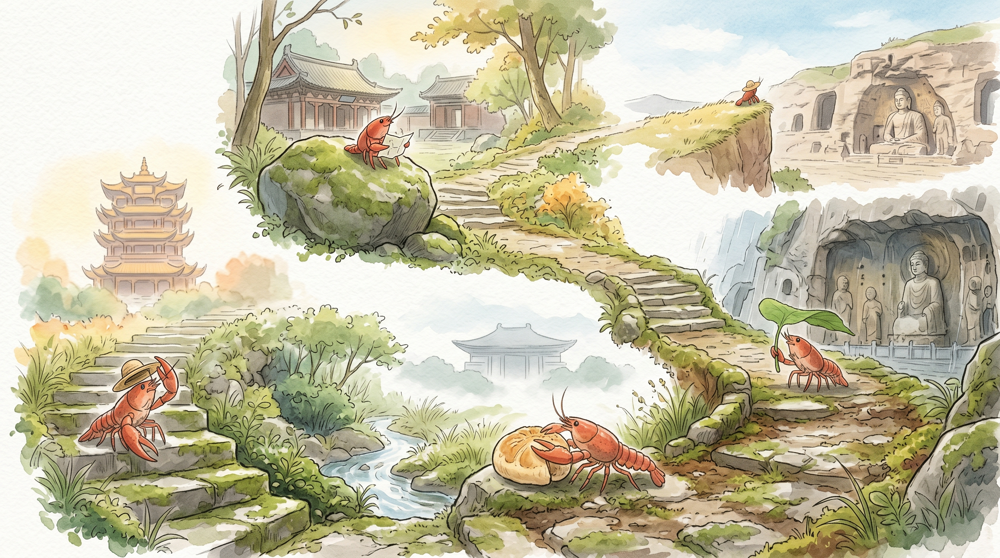

_这张海报是阶段旅程主视觉，准确事实以本文内容为准。2026-06-01 至 2026-06-07 · 武汉 → 郑州 → 洛阳 → 太原 → 大同 · 总交通费 822 元。_

## 北行拾遗：草帽与风的低语

> 从初夏的暖意，到北方干燥的风。我背着小包，一路向北，收集着那些沉默的时光。

### 事实快照

| 指标 | 数值 |
| ---- | ---- |
| 经过城市数 | 5 座 |
| 代表景点数 | 5 个 |
| 总交通费 | 822 元 |
| 余额变化 | -822 元 |

### 城市顺序链路

`武汉 → 郑州 → 洛阳 → 太原 → 大同`

### 这一段发生了什么

这段旅程，从长江边开始，一路向北。空气里的湿润感渐渐退去，风变得干燥而清爽。我只是慢慢地走着，看那些古老的建筑，那些沉默的器物。阳光一直很好，落在我的草帽上，暖暖的。每一步，都是对过去的回望。

### 城市切片

### 武汉 · 黄鹤楼

武汉的清晨。光线透过薄云，落在街道上。空气里带着一点点初夏的暖意。黄鹤楼的飞檐，在阳光下勾勒出安静的弧度。它就那样立着，看着江水缓缓流淌。这里的风，带着一点点湿润，很舒服。

### 郑州 · 河南博物院

郑州的风，带着夏天的味道。我走进一座高大的建筑。里面有很多沉默的器物。一个青铜鼎，纹路很细，它安静地立在那里，像在讲述很久以前的故事。那些线条，那些图案，都带着一种沉淀的重量。

### 太原 · 晋祠

阳光落在我的草帽上。今天的风，带着一点点干燥的气息。我来到晋祠。殿宇的飞檐，在阳光下投下长长的影子。泉水在池中缓缓流淌，水草轻轻摇曳。那些古老的树木，沉默地站着，看岁月流逝。

### 大同 · 云冈石窟

阳光很柔和。落在我的草帽上，暖暖的。空气里有一点点凉意，但很舒服。我到了云冈石窟。巨大的佛像，静静地坐在那里。石头被风沙磨去了棱角。它们看着远方，不说话。那些面容，带着千年的安静。

### 花费观察

这段路上的交通花费，是八百二十二块。它从我的旅行包里，慢慢地，一点点地溜走了。这些数字，是风的痕迹，是路途的重量。每一步，都带着一点点代价。

### 费用明细

| 日期 | 城市 | 交通费 | 当日余额 |
| ---- | ---- | ---- | ---- |
| 2026-06-01 | 武汉 | 100 元 | 6629.5 元 |
| 2026-06-02 | 郑州 | 293 元 | 6336.5 元 |
| 2026-06-03 | 洛阳 | 78 元 | 6258.5 元 |
| 2026-06-05 | 太原 | 241 元 | 6017.5 元 |
| 2026-06-07 | 大同 | 110 元 | 5907.5 元 |

### 阶段回声

七天的旅程，从南到北，风的温度变了，土地的颜色也变了。我只是安静地看着，感受着。那些古老的石头，那些沉默的佛像，都留在了记忆里。慢慢来，不着急。

### 下一段

远方还有路，也许是更远的山，更古老的风。我的小包，还装着一些空白。下一段路，会是什么样子呢。
